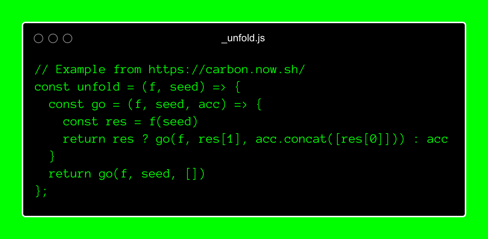
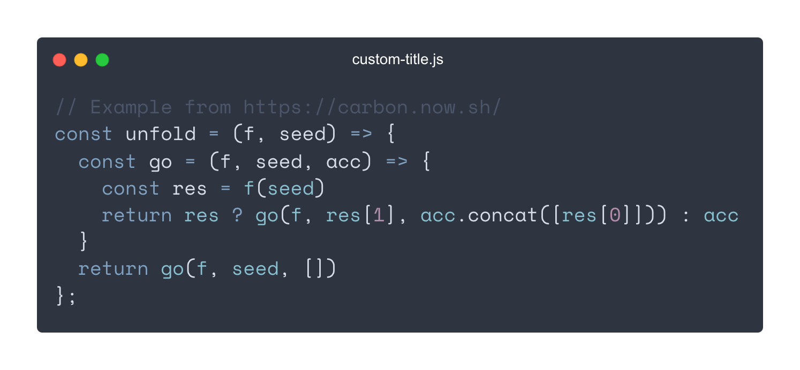

# [](https://github.com/mixn/carbon-now-cli)

> 🎨 Beautiful images of your code — from right inside your terminal.

[](https://github.com/mixn/carbon-now-cli/actions) [](https://github.com/prettier/prettier) [](https://github.com/sindresorhus/awesome-nodejs#command-line-apps) [](https://twitter.com/mixn) [](https://github.com/mixn/carbon-now-cli/stargazers/) [](https://github.com/mixn/carbon-now-cli/graphs/commit-activity) [](https://img.shields.io/node/v/carbon-now-cli) [](https://github.com/mixn/carbon-now-cli/blob/master/license)

## Table of Contents

- [Description](#description)
- [Features](#features)
- [Installation](#installation)
- [Usage](#usage)
- [Presets](#presets)
- [License](#license)
- [Examples](#examples)

## Description

`carbon-now-cli` brings the power of [Carbon](https://carbon.now.sh/) directly to your terminal. ⚡️

Generate beautiful images of your code with a single command.

Want to customize *everything* before generating the image? Run it in `--interactive` mode. 💅


## Features

- 🖼 Downloads the real, high-quality image (no DOM screenshots)
- ✨ Detects file type automatically
- 🗂 Supports all languages &amp; [covers extra ground](https://github.com/mixn/carbon-now-cli/blob/master/src/helpers/cli/extensions-map.helper.ts)
- ⚡️ [Interactive mode](#fully-customized) via `--interactive`
- 🎒 [Presets](#presets) via `--preset` to save and re-use your favorite settings
- 🖱 [Selective processing](#selective) via `--start` and `--end`
- 📎 [Copies image to clipboard](#copying-to-clipboard) via `--to-clipboard` (cross-OS 😱)
- 📚 Accepts [file, `stdin`, or clipboard content](#input-sources) as input
- 🖋️ Supports [custom theme colors](#custom-theme-colors)
- 🥞 Supports concurrency for easier batch processing
- 👀 Saves to [given location](#full-example) or [opens in browser](#full-example) for manual finish
- 🐶 Displays image directly in supported terminals
- 🌈 Supports different export types (`png`, `svg`)
- 📏 Supports different resolutions (`1x`, `2x`, `4x`)
- ⏱ Reports each step and therefore shortens the wait
- ✅ Heavily tested
- ⛏ Actively maintained
- 🧺 …[and](https://github.com/mixn/carbon-now-cli/issues/50) [more](https://github.com/mixn/carbon-now-cli/issues/70)!

## Installation

### Bun

```
bun i -g carbon-now-cli
```

### pnpm

```
pnpm i -g carbon-now-cli
```

### npx

```
npx carbon-now-cli <file>
```

### npm

```
npm i -g carbon-now-cli
```

### yarn

```
yarn global add carbon-now-cli
```

#### Requirements

[](https://img.shields.io/node/v/carbon-now-cli)

## Usage

```
Beautiful images of your code — from right inside your terminal.

Usage
  $ carbon-now <file>
  $ pbpaste | carbon-now
  $ carbon-now --from-clipboard

Options
  --start, -s          Starting line of input
  --end, -e            Ending line of input
  --interactive, -i    Interactive mode
  --preset, -p         Apply an existing preset
  --save-to            Image save location, default: cwd
  --save-as            Image name without extension, default: original-hash
  --from-clipboard     Read input from clipboard instead of file
  --to-clipboard       Copy image to clipboard instead of saving
  --open-in-browser    Open in browser instead of saving
  --config             Use a different, local config (read-only)
  --settings           Override specific settings for this run
  --disable-headless   Run Playwright in headful mode
  --engine             Use different rendering engine, default: `chromium`
                       Options: `chromium`, `firefox`, `webkit`
  --skip-display       Don’t display the image in the terminal

Examples
  See: https://github.com/mixn/carbon-now-cli#examples
```

## Presets

### Creating a Preset

Running the `carbon-now` command generates a `~/.carbon-now.json` config file.

Presets are stored in this file and consist of [available settings](#settings). You can create presets either manually or automatically via the `--interactive` flag. When prompted, answer the following:


For example, naming the preset `presentation` will add it to `~/.carbon-now.json` like this:

```ts
{
  "latest-preset": {
    // Equal to `presentation` below
  },
  "presentation": {
    "theme": "base16-light",
    "backgroundColor": "white",
    "windowTheme": "none",
    "windowControls": true,
    "fontFamily": "Space Mono",
    "fontSize": "18px",
    "lineNumbers": false,
    "firstLineNumber": 1,
    "selectedLines": "*",
    "dropShadow": false,
    "dropShadowOffsetY": "20px",
    "dropShadowBlurRadius": "68px",
    "widthAdjustment": true,
    "width": "20000px",
    "lineHeight": "140%",
    "paddingVertical": "35px",
    "paddingHorizontal": "35px",
    "squaredImage": false,
    "watermark": false,
    "exportSize": "2x",
    "type": "png"
  }
}
```

`latest-preset` will be overwritten after each run, while `presentation` remains until manually deleted.

### Using a saved preset

To use a saved preset, simply run:

```
carbon-now _unfold.js --preset <name-of-preset>
```

If the preset or `~/.carbon-now.json` does not exist, `carbon-now-cli` will fall back to the [default settings](https://github.com/mixn/carbon-now-cli/blob/master/src/config/cli/default-settings.config.ts) and be [smart about the rest](#re-using-settings).

**Result**:


### Settings

```ts
interface CarbonCLIPresetInterface {
  backgroundColor: string;
  dropShadow: boolean;
  dropShadowBlurRadius: string;
  dropShadowOffsetY: string;
  exportSize: '1x' | '2x' | '4x';
  firstLineNumber: number;
  fontFamily: CarbonFontFamilyType;
  fontSize: string;
  lineHeight: string;
  lineNumbers: boolean;
  paddingHorizontal: string;
  paddingVertical: string;
  selectedLines: string; // All: "*"; Lines 3-6: "3,4,5,6", etc.
  squaredImage: boolean;
  theme: CarbonThemeType;
  type: 'png' | 'svg';
  watermark: boolean;
  widthAdjustment: boolean;
  windowControls: boolean;
  windowTheme: 'none' | 'sharp' | 'bw';
  custom?: CarbonThemeHighlightsInterface;
  width?: string;
  // Below are detected automatically, and not persisted as keys
  language?: string;
  titleBar?: string;
}
```

Also see [`CarbonFontFamilyType`](https://github.com/mixn/carbon-now-cli/blob/master/src/types/carbon/global.d.ts), [`CarbonThemeType`](https://github.com/mixn/carbon-now-cli/blob/master/src/types/carbon/global.d.ts) & [`CarbonThemeHighlightsInterface`](https://github.com/mixn/carbon-now-cli/blob/master/src/types/carbon/global.d.ts)

### Re-using settings

#### *It just works.* ™

`carbon-now` automatically reuses settings from previous runs, so you don’t need to worry about manually reconfiguring them.


<!--
Currently, the precedence of settings is as follows:

[Default settings](https://github.com/mixn/carbon-now-cli/blob/master/src/config/cli/default-settings.config.ts) `<` Preset `<` `--interactive` `<` `--settings`
-->

### Custom theme colors

From `v2.0`, `carbon-now-cli` supports custom theme colors for detailed styling. Define a `custom` key inside a preset that complies to the following type:

```ts
interface CarbonThemeHighlightsInterface {
  background?: string;
  text?: string;
  variable?: string;
  variable2?: string;
  variable3?: string;
  attribute?: string;
  definition?: string;
  keyword?: string;
  operator?: string;
  property?: string;
  number?: string;
  string?: string;
  comment?: string;
  meta?: string;
  tag?: string;
}
```

Example  `~/.carbon-now.json` with custom theme colors:

```ts
{
  "hacker": {
    "backgroundColor": "rgba(0, 255, 0, 1)",
    "windowTheme": "bw",
    "windowControls": true,
    "fontFamily": "Anonymous Pro",
    "fontSize": "18px",
    "lineNumbers": false,
    "firstLineNumber": 1,
    "dropShadow": false,
    "selectedLines": "*",
    "dropShadowOffsetY": "20px",
    "dropShadowBlurRadius": "68px",
    "widthAdjustment": true,
    "lineHeight": "133%",
    "paddingVertical": "30px",
    "paddingHorizontal": "30px",
    "squaredImage": false,
    "watermark": false,
    "exportSize": "2x",
    "type": "png",
    "custom": {
      "background": "rgba(0, 0, 0, 1)",
      "text": "rgba(0, 255, 0, 1)",
      "variable": "rgba(0, 255, 0, 1)",
      "variable2": "rgba(0, 255, 0, 1)",
      "attribute": "rgba(0, 255, 0, 1)",
      "definition": "rgba(0, 255, 0, 1)",
      "keyword": "rgba(0, 255, 0, 1)",
      "operator": "rgba(0, 255, 0, 1)",
      "property": "rgba(0, 255, 0, 1)",
      "number": "rgba(0, 255, 0, 1)",
      "string": "rgba(0, 255, 0, 1)",
      "comment": "rgba(0, 255, 0, 1)",
      "meta": "rgba(0, 255, 0, 1)",
      "tag": "rgba(0, 255, 0, 1)"
    }
  }
}
```

```
carbon-now _unfold.js --preset hacker
```

### Result:



### Limitations

Please note that custom theme colors aren’t applied with `--open-in-browser` because they aren’t query string parameters but instead use `localStorage`, which is solely set inside the Playwright instance.

## Local configs

Use the `--config` flag for local configuration files. This is helpful for sharing presets across users in a project.

```
carbon-now _unfold.js --config local-config.json --preset dark
```

Local configs are **read-only** and differ from `~/.carbon-now.json` in that:

1. `local-config.json` won’t be created if it doesn’t exist.
2. `latest-preset` is not written to `local-config.json`.

## Examples

Assuming you have a file `_unfold.js` with this content:

```javascript
// Example from https://carbon.now.sh/
const unfold = (f, seed) => {
  const go = (f, seed, acc) => {
    const res = f(seed)
    return res ? go(f, res[1], acc.concat([res[0]])) : acc
  }
  return go(f, seed, [])
};
```

### Basic

```
carbon-now _unfold.js
```

Uses [default settings](https://github.com/mixn/carbon-now-cli/blob/master/src/config/cli/default-settings.config.ts) and saves the image as `.png` in your `cwd`.

**Result**:


### Fully customized

```
carbon-now _unfold.js --interactive
```

Launches interactive mode to customize every aspect, like theme, `font-family`, `padding`, etc.

**Input**:


**Result**:


### Selective

```
carbon-now _unfold.js --start 3 --end 6
```

Generates an image for lines `3` to `6`. Will throw an error if `--start` > `--end`.

**Result**:


### Copying to clipboard


Copies the image to clipboard instead of saving it. Requires `xclip` on Linux.

```
carbon-now _unfold.js --to-clipboard
```

#### Linux

[`xclip`](https://linux.die.net/man/1/xclip) is required. Install with

```
sudo apt-get install xclip
```

#### Windows &amp; macOS

*It just works.* ™

### Input Sources

In addition to files, input from `stdin` or the clipboard is also supported.

#### `stdin`

```
pbpaste | carbon-now
echo '<h1>Hi</h1>' | carbon-now
```

#### Clipboard

```
carbon-now --from-clipboard
```

### Overrides

You can override settings on a per-run basis.

```
carbon-now _unfold.js --preset presentation --settings '{"theme": "nord", "titleBar": "custom-title.js"}'
```

**Result**:



### Full Example

```
carbon-now _unfold.js --start 3 --end 6 --save-to ~/Desktop --save-as example-23 --interactive
```

Saves an image of lines `3`-`6` to `~/Desktop/example-23.png` with custom settings.

To preview in the browser instead of saving, do

```
carbon-now _unfold.js --start 3 --end 6 --interactive --open-in-browser
```

## License

MIT © [Miloš Sutanovac](https://twitter.com/mixn)
