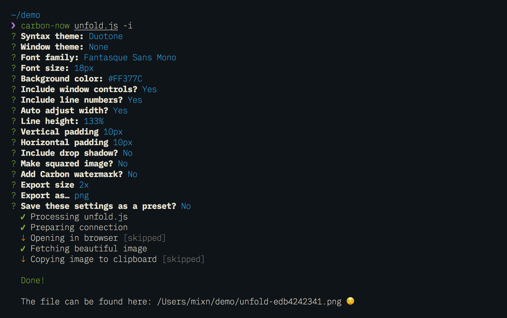
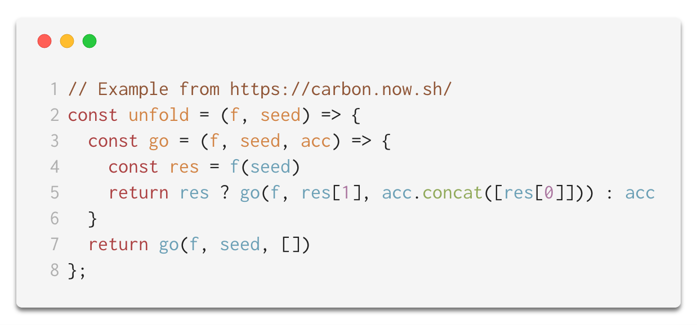

# [](https://github.com/mixn/carbon-now-cli)

> 🎨 Beautiful images of your code — from right inside your terminal.

[](https://travis-ci.org/mixn/carbon-now-cli) [](https://github.com/xojs/xo) [](https://github.com/mixn/carbon-now-cli/blob/master/license) [](https://github.com/mixn/carbon-now-cli/graphs/commit-activity) [](https://github.com/sindresorhus/awesome-nodejs#command-line-apps) [](https://twitter.com/mixn)

## Description

[carbon.now.sh](https://carbon.now.sh/) by [@dawn_labs](https://twitter.com/dawn_labs) is a wonderful tool that lets you generate beautiful images of your source code through an intuitive UI, while letting you customize aspects like fonts, themes, window controls and much more.

`carbon-now-cli` gives you the **full power of Carbon** — right at your fingertips, **inside the terminal**.

Generate beautiful images from a source file, or *sections of a source file*, by running a single command.

Want to customize **everything** before generating the image? Run it in ⚡️ **interactive mode** ⚡️. 😎


## Features

- 🖼 Downloads the **real**, **high-quality** image (*no DOM screenshots*)
- ✨ Detects file type **automatically**
- 🗂 Supports **all** file extensions supported by [carbon.now.sh](https://carbon.now.sh) and [more](https://github.com/mixn/carbon-now-cli/blob/master/src/helpers/language-map.json)
- 🖱 Allows selective highlighting via `--start` and `--end`
- ⚡️ Interactive mode via `--interactive`
- 🎒 [Presets](https://github.com/mixn/carbon-now-cli#presets): save and reuse your favorite settings
- 🐶 Displays image directly in supported terminals
- ⏱ Reports each step and therefore *shortens the wait*
- 👀 Saves to given location or only opens in browser for manual finish
- 🌈 Supports saving as `.png` or `.svg` — just like Carbon
- 📏 Supports `2x`, `4x` or `1x` resolutions — just like Carbon
- ✅ Tested
- ⛏ Maintained

## Installation

#### npm
```
$ npm i -g carbon-now-cli
```

#### yarn
```
$ yarn global add carbon-now-cli
```

#### npx
```
$ npx carbon-now-cli <file>
```

#### Requirements

`carbon-now-cli` requires Node.js `>=8.3`.

## Usage

```
$ carbon-now --help

Beautiful images of your code — from right inside your terminal.

Usage
  $ carbon-now <file>

Options
  -s, --start          Starting line of <file>
  -e, --end            Ending line of <file>
  -i, --interactive    Interactive mode
  -l, --location       Image save location, default: cwd
  -o, --open           Open in browser instead of saving
  -p, --preset         Use a saved preset
  -h, --headless       Use only non-experimental Puppeteer features
```

## Examples

Assuming you have a file `unfold.js` with this content

```javascript
// Example from https://carbon.now.sh/
const unfold = (f, seed) => {
  const go = (f, seed, acc) => {
    const res = f(seed)
    return res ? go(f, res[1], acc.concat([res[0]])) : acc
  }
  return go(f, seed, [])
};
```

and you’d like to make a beautiful image out of it. You could approach this in several ways.

#### Basic

```
$ carbon-now unfold.js
```

Takes the entire source of `unfold.js`, uses Carbon’s default settings and saves as `.png` into your `cwd`.

**Result**:


**Note**: `carbon-now` will be smart enough to reuse your last used settings, instead of the default ones. 🤓

#### Fully customized

```
$ carbon-now unfold.js -i
```

Launches an interactive mode, prompting questions, allowing you to customize every aspect of Carbon, like syntax theme, font-family, padding, drop-shadow, etc.

Given this input…



…the result will look like so 😍:


If you’re not sure what each question, e.g. “Make squared image?”, refers to, just confirm by hitting **Enter** — it will default to a sensible, nice-looking thing.

If needed, you can always check the [default settings](https://github.com/mixn/carbon-now-cli/blob/master/src/helpers/default-settings.js).

#### Selective

```
$ carbon-now unfold.js -s 3 -e 6
```

Reads and creates an image based on lines `3` to `6`, instead of the entire file. Will throw an error if `-s` > `-e`.

Selective mode can of course be combined with interactive mode, just with like any other option. 😊

**Result**:


**Note**: `carbon-now` will be smart enough to reuse your last used settings, instead of the default ones. 🤓

#### Full Example

For demonstration purposes, here is an example using all options.

```
$ carbon-now unfold.js -s 3 -e 6 -l ~/Desktop -i
```

This saves a beautiful image of lines `3` to `6` to `~/Desktop`, after accepting custom wishes via interactive mode.

If you’re not sure how exactly the image will turn out, you can always use `-o` or `--open`.

```
$ carbon-now unfold.js -s 3 -e 6 -i -o
```

This will open the image in the browser for final touches, instead of saving it immediately. 😌

## Presets

#### About

The most requested feature after `carbon-now-cli`’s initial release has been the support for **reusable settings**, to not having to go through the entire process of answering all questions in interactive mode each time.

Presets are officially included as of `v1.1.0` of `carbon-now-cli`. 🎉

#### Creating a preset

However you use the `carbon-now` command, a `~/.carbon-now.json` file will be created for you. This is where all your presets and the settings of the last interactive run will live.

When running `carbon-now` with `-i`, you’ll be asked the following two questions last:


Answering with yes and naming the preset (in this case `presentation`) will result in the preset being saved to `~/.carbon-now.json`. In this particular case, `~/.carbon-now.json` will look like so:

```
{
  "latest-preset": {
    "t": "base16-light",
    "bg": "none",
    "wt": "none",
    "wc": true,
    "fm": "Inconsolata",
    "fs": "18px",
    "ln": true,
    "ds": true,
    "dsyoff": "3px",
    "dsblur": "5px",
    "wa": true,
    "pv": "15px",
    "ph": "15px",
    "si": false,
    "wm": false,
    "es": "2x",
    "type": "png"
  },
  "presentation": {
    "t": "base16-light",
    "bg": "none",
    "wt": "none",
    "wc": true,
    "fm": "Inconsolata",
    "fs": "18px",
    "ln": true,
    "ds": true,
    "dsyoff": "3px",
    "dsblur": "5px",
    "wa": true,
    "pv": "15px",
    "ph": "15px",
    "si": false,
    "wm": false,
    "es": "2x",
    "type": "png"
  }
}
```

`latest-preset` will be overwritten after each interactive run. `presentation` is meant to stay until you eventually decide to delete it manually.

#### Using a saved preset

Reusing presets is as easy and straight-forward as:

```
carbon-now unfold.js -p <name-of-preset>
```

If a given preset or `~/.carbon-now.json` doesn’t exist, `carbon-now-cli` will fall back to the [default settings](https://github.com/mixn/carbon-now-cli/blob/master/src/helpers/default-settings.js).

Taken the `presentation` preset we have created above, this is all we have to do:

```
carbon-now unfold.js -p presentation
```

Result:



#### Reusing the last used settings

*It just works!* ™ 🎉

Any time you use `-i`, `carbon-now-cli` will automatically reuse those settings for its next run.

So you can `carbon-now <file> -i` and `carbon-now <file>` from there on — the output will always look as pretty as the one where you’ve used `-i`. 😊

## License

MIT © [Miloš Sutanovac](https://twitter.com/mixn)
